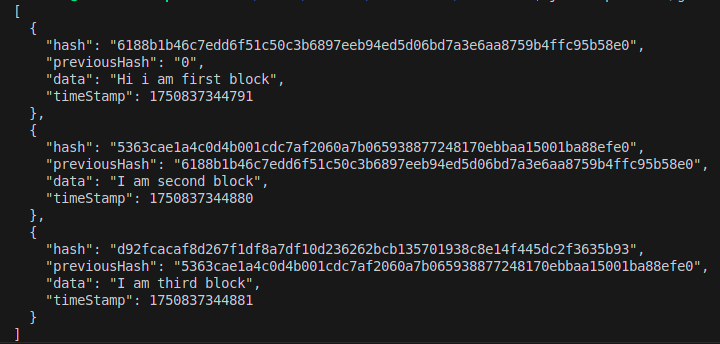

<h1>ProtoChain</hi>
<h2>In this repo i will be creating a blockchain but it will not be fully 
functioning and ready for the production.It will be a learning project only.
To understand:-</h2>

->  Blocks and Hashing

->  Proof of Work (Mining)

->  Chain Validation
and may be many more.

<h3>A blockchain is just like a linked list connected with each others where each block contains the hash of previous block with it's own hash calculated from the previous hash.
If the previous block's data is changed then the previous block hash will be change.Changing any data in the list will change the hash of the block and will break the chain.</h3>

this is the blockchain with raw data but i will make it more cool by adding some new cool tings.